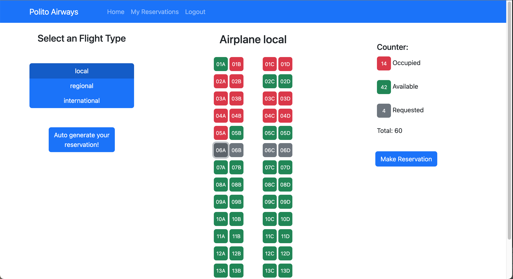

# Exam #2: "Airplane Seats"

## Student: s307135 HIOKI ERIC

# Server side

Description:
The index.js file includes the endpoints of the server side.
The routes folder contains the routes specific to a particular entity with it's logic
The daos folder countains the Data Access Object module to access the database

## API Server

- POST `/api/sessions/register`
  - request
    - parameters: none
    - body: { email, name, password }
  - response
    - 201: CREATED
    - 500: Internal Server Error
      - body: { error }
- POST `/api/sessions/login`
  - request
    - parameters: none
    - body: { username, password }
  - response
    - 200: OK
      - body: {id, username, name}
    - 401: Unauthorized User
      - body: { error }
    - 500: Internal Server Error
      - body: { error }
- GET `/api/sessions/current`
  - request
    - parameters: none
    - body: none
  - response
    - 200: OK
      - body: { email, name, password, salt }
    - 401: Unauthorized User
      - body: { error }
    - 500: Internal Server Error
      - body: { error }
- DELETE `/api/sessions/current`
  - request
    - parameters: none
    - body content: none
  - response
    - 200: OK
    - 401: Unauthorized User
      - body: { error }
    - 500: Internal Server Error
      - body: { error }
- POST `/api/reservations/`
  - request
    - parameters: none
    - body content: { airplane_type, row, col, used_id }
  - response
    - 200: OK
    - 503: Service Unavailable
      - body: { error }
- GET `/api/reservations/id/:id`
  - request
    - parameters: reservation id
    - body content: none
  - response
    - 200: OK
      - body: [{ id, airplane_type, row, col, user_id }, ...]
    - 404: Not Found
      - body: { error }
    - 500: Internal Server Error
      - body: { error }
- GET `/api/reservations/all`
  - request
    - parameters: none
    - body content: none
  - response
    - 200: OK
      - body: [{ id, airplane_type, row, col, user_id }, ...]
    - 404: Not Found
    - body: { error }
    - 500: Internal Server Error
      - body: { error }
- DELETE `/api/reservations/:id`
  - request
    - parameters: reservation id
    - body content: none
  - response
    - 200: OK
    - 404: Not Found
      - body: { error }
    - 503: Service Unavailable
      - body: { error }

## Database Tables

- `users`
  - "id" INTEGER NOT NULL UNIQUE,
  - "email" TEXT NOT NULL UNIQUE,
  - "name" TEXT NOT NULL,
  - "password" TEXT NOT NULL,
  - "salt" TEXT NOT NULL,
  - PRIMARY KEY("id" AUTOINCREMENT)
- `reservatinons`
  - "id" INTEGER NOT NULL UNIQUE,
  - "airplane_type" TEXT NOT NULL,
  - "row" INTEGER NOT NULL,
  - "col" TEXT NOT NULL,
  - "user_id" INTEGER NOT NULL,
  - PRIMARY KEY("id" AUTOINCREMENT),
  - FOREIGN KEY("user_id") REFERENCES "users"("id")

# Client side

## React Client Application Routes

- Route `/`: MainPage -> Main Page of the application. If the user is not logged in, it shows shows the airplane seats and the counter of the seats with the status. If the user is logged in, it shows the airplane seats, the buttons to switch the airplane type, the counter of the seats with the status, the button to make the Automatic Reservation and the button to make the Selected Reservation. Params passed throught props: user logged in object and isLoggedIn variable.
- Route `/reservations`: MyReservationsPage -> Page to show the reservations of the user logged in. It's only accessible to logged in users. Params passed throught props: user logged in object.
- Route `/login`: LoginPage -> Page to perform the log in of the user. Params passed throught props: handleLogin function.

## Main React Components

### Components

- `Airplane` (in `Airplane.js`): Layout of the Airplane Seats. It shows the Seats of each type of Airplanes (local, regional, international) and it's status (Available, Occupied, Requested and Highlighted). In this component, you can click the Available Seats to make them Requested. It is present in the MainPage.
- `AutoReservationModal` (in `AutoReservationModal.js`): Modal for making the Automatic Reservation. Inside this Component, there are two other Components (AutoReservationForm and AutoReservationConfirm). In the AutoReservationForm, the user choose the type of the flight and how much seats to reserve. In the AutoReservationConfirm, the Component generates the Automatic Reservation for the user and shows the requested Seats for the user to confirm the reservation. It is present in the MainPage.
- `CancelReservationModal` (in `CancelReservationModal.js`): Modal to cancel the reservations made. It is present in the MyReservationsPage.
- `NavBar` (in `NavBar.js`): Navigation Bar of the application. The user can navigate through the application clicking the Links present in this Component
- `ReservationModal` (in `ReservationModal.js`): Modal to reserve the requested seats that were choosen by the user. It shows a Confirmation Modal for the user to confirm the reservation. It is present in the MainPage.
- `SeatCounter` (in `SeatCounter.js`): Counter to count the Seats of each status (Available, Occupied, Requested). It is present in the MainPage

# Usage info

## Screenshot

## Users Credentials

- username: user@test, password: password
- username: user1@test, password: password
- username: user2@test, password: password
- username: user3@test, password: password
